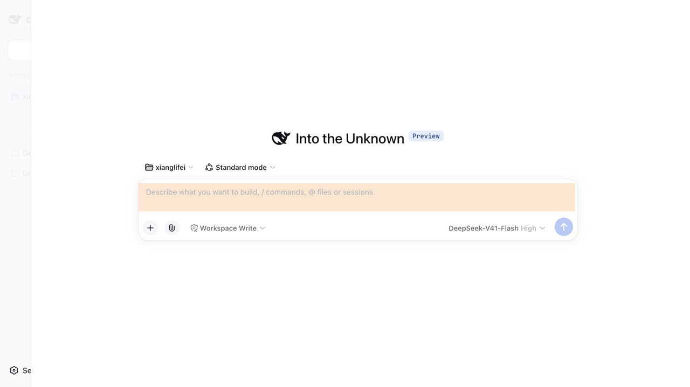

# dsh-peak-hours

DSH Web 输入框忙时着色提醒插件。

DeepSeek API 自 2026-08-17 起实行峰谷定价（闲时价格为高峰的一半）：

- **高峰（忙时）**：北京时间周一至周五 9:00–12:00、14:00–18:00
- **闲时**：其余全部时段；周末（周六、周日）全天闲时（2026-08-23 起）

来源：[DeepSeek 官方「模型 & 价格」](https://api-docs.deepseek.com/zh-cn/quick_start/pricing/)

本插件在 Web UI 的聊天输入框上做颜色提醒：忙时给输入框加半透明橙色底色，闲时保持原样。时段判定在浏览器端完成（固定 UTC+8 偏移，与本机时区无关），每 30 秒刷新一次，页面重渲染后自动重涂。



## 安装（本地开发）

```sh
dsh plugin --profile web add link:<本目录绝对路径>
```

装完后刷新 DSH Web 页面即可（profile 开着 `patchReload: live` 时无需重启 DSH）。

## 卸载

```sh
dsh plugin --profile web remove dsh-peak-hours
```

## 验证

不用等到工作日早上：在 DSH Web 页面 URL 后加 `#dsh-peak-demo` 强制视为忙时（看橙色效果），加 `#dsh-peak-demo=0` 强制视为闲时。用 hash 形式最可靠——`?token=...` 这类查询串会被 dsh web 重定向清掉，hash 能留下来。

控制台里还有个调试面 `window.__dshPeakHoursDebug`，能看到最近一次判定状态和前 12 次 apply 的时间线。

## 已知限制

- 输入框靠 DOM 结构识别：`#root` 下排除弹窗与 whale 挂件面板，优先取祖先链带 `composer` 语义类名的候选，退化时取唯一候选。刻意不依赖元素尺寸——后台/被遮挡标签页里渲染被冻结，`offsetWidth` 是陈旧值，尺寸判断会间歇性误杀。DSH 前端大改版时需要同步调整 `assets/peak-hours.js` 里的 `candidates()`。
- 时段表硬编码在 `assets/peak-hours.js` 的 `isPeakNow()`，官方调整时段时改这一处即可。
- React 重渲染会抹掉外加 class，脚本靠 MutationObserver + 轮询每轮重申；标签页切走再切回最多等一个轮询周期（30 秒）恢复。
